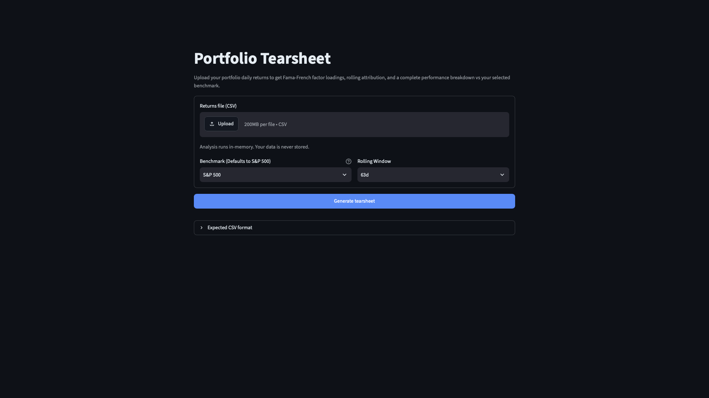
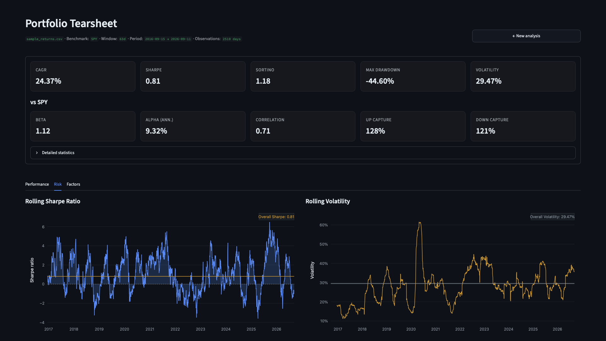

# Portfolio Tearsheet

Upload a CSV of daily returns → get a full performance & risk tearsheet:
Sharpe / Sortino / Calmar, drawdown analysis, CAPM + Fama-French regressions,
rolling factor exposures, and a monthly returns heatmap.




## Quickstart

```bash
git clone https://github.com/Emilyyy-Ng/portfolio-tearsheet.git
cd portfolio-tearsheet
pip install -r requirements.txt
streamlit run app.py
```

Opens at `http://localhost:8501`.

## Input format

CSV, first column = date index, second column = daily **simple** returns in
decimal form (`0.012` = +1.2%). No benchmark column needed — it's fetched
automatically from your selection.

```csv
date,portfolio_return
2023-01-03,-0.0008
2023-01-04,-0.0068
2023-01-05, 0.0120
2023-01-06, 0.0109
```

See `examples/sample_returns.csv` for a full example.

## Features

- **Performance** — CAGR, volatility, Sharpe, Sortino, Calmar, Information Ratio
- **Risk** — max drawdown, drawdown duration, VaR / CVaR, win rate, profit factor, up / down capture
- **Attribution** — CAPM, Fama-French 3- and 5-factor regressions, rolling factor betas
- **Charts** — equity curve, underwater plot, return distribution, rolling Sharpe, rolling volatility, monthly heatmap

Benchmarks: S&P 500, NASDAQ-100, Dow Jones, Russell 2000, Total Stock Market.

## Stack

Python · Streamlit · pandas · statsmodels · Plotly · yfinance · pandas-datareader

## Roadmap / known limitations

- [ ] Auto-detect price vs. return input (currently expects decimal returns)
- [ ] Unit tests for `analytics.py`
- [ ] Vectorise rolling OLS (currently loops per window)
- [ ] Multi-portfolio comparison
- [ ] Portfolio optimisation (mean-variance, risk parity)
- [ ] Deploy to Streamlit Community Cloud

## License

MIT — see [LICENSE](LICENSE).